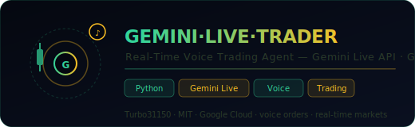

<div align="center">
  
  <br/><br/>

  [](LICENSE)
  [](#)
  [](#)
  [](#)
  [](https://github.com/Turbo31150/jarvis-linux)

  <br/>
  <p><strong>Real-Time Voice Trading Assistant · Gemini Live API · Voice Orders · Live Markets · Google Cloud</strong></p>
  <p><em>Execute trading orders by voice — Gemini analyzes markets in real-time and runs your strategies</em></p>
</div>

---

## Overview

**GEMINI·LIVE·TRADER** is a voice-first trading assistant built on the **Gemini Live API**. It lets you place orders, analyze markets, and manage positions entirely through voice commands — with real-time AI analysis powered by Gemini.

Say *"Buy 0.1 BTC at market"* and it executes. Ask *"What's the BTC RSI on 4h?"* and it answers out loud.

---

## Features

| Feature | Description |
|---------|-------------|
| **Voice Commands** | Natural language order placement — "Buy 0.1 BTC at market" |
| **Real-Time Analysis** | Gemini analyzes price, volume, and momentum as markets move |
| **Market Q&A** | Ask technical questions — RSI, MACD, support/resistance — get spoken answers |
| **Smart Alerts** | Voice notifications on market events, stop-loss triggers, and anomalies |
| **Portfolio Reports** | "Show my PnL" — instant spoken portfolio summary |
| **Multi-Exchange** | Pluggable execution layer for different exchange APIs |
| **Streaming Audio** | Full-duplex voice — listen and speak simultaneously |

---

## Architecture

```
┌─────────────────────────────────────────────────────┐
│                    User (Microphone)                 │
└──────────────────────┬──────────────────────────────┘
                       ▼
┌─────────────────────────────────────────────────────┐
│            Gemini Live API (Google Cloud)            │
│         STT  ←→  LLM Reasoning  ←→  TTS            │
└──────────────────────┬──────────────────────────────┘
                       ▼
┌─────────────────────────────────────────────────────┐
│                  Intent Parser                       │
│  ┌─────────────┬──────────────┬──────────────────┐  │
│  │ MARKET_DATA │ PLACE_ORDER  │   PORTFOLIO      │  │
│  │ fetch price │ execute via  │   positions &    │  │
│  │ & volume    │ exchange API │   PnL summary    │  │
│  └─────────────┴──────────────┴──────────────────┘  │
│  ┌─────────────────────────────────────────────────┐ │
│  │              ANALYSIS                           │ │
│  │     Technical indicators + AI summary           │ │
│  └─────────────────────────────────────────────────┘ │
└──────────────────────┬──────────────────────────────┘
                       ▼
┌─────────────────────────────────────────────────────┐
│             Execution Layer (Exchange API)           │
│           Binance · Kraken · CCXT-compatible        │
└──────────────────────┬──────────────────────────────┘
                       ▼
┌─────────────────────────────────────────────────────┐
│          Voice Response (Gemini TTS streaming)       │
└─────────────────────────────────────────────────────┘
```

---

## Quick Start

```bash
git clone https://github.com/Turbo31150/gemini-live-trading-agent.git
cd gemini-live-trading-agent
pip install -r requirements.txt
```

Set your environment variables:

```bash
export GOOGLE_API_KEY=AIza...
export EXCHANGE_API_KEY=your_exchange_key
export EXCHANGE_SECRET=your_exchange_secret
```

Run:

```bash
python main.py
```

---

## Usage Examples

```
You:    "What's the current price of ETH?"
Gemini: "Ethereum is trading at $3,842, up 2.3% in the last 24 hours."

You:    "Place a limit buy for 1 ETH at $3,800."
Gemini: "Limit buy order placed: 1 ETH at $3,800. I'll notify you when it fills."

You:    "Show my open positions."
Gemini: "You have 2 open positions: 0.5 BTC in profit at +4.1%, and 100 SOL at -1.2%."
```

---

## JARVIS Ecosystem

This project is part of the **JARVIS** distributed AI cluster:

- [jarvis-linux](https://github.com/Turbo31150/jarvis-linux) — Distributed Autonomous AI Cluster
- [TradeOracle](https://github.com/Turbo31150/TradeOracle) — Autonomous Crypto Trading Agent
- [lumen](https://github.com/Turbo31150/lumen) — Multilingual Live AI Web App
- **gemini-live-trading-agent** — Voice Trading Assistant *(this repo)*

---

## License

MIT © 2026 [Turbo31150](https://github.com/Turbo31150) — Franck Delmas

> Built with Google Cloud · Gemini Live API
